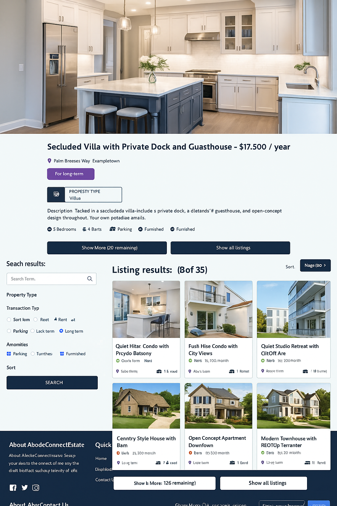

# Backend Directory - README

## Overview

The `api` directory contains the backend implementation of a real estate platform. It provides APIs for user authentication, property listing management, and profile management. The backend is built with Node.js and Express, using MongoDB for database storage and Cloudinary for image hosting.

---

## Tech Stack

- **Node.js**: Server-side JavaScript runtime.
- **Express**: Web framework for building APIs.
- **MongoDB**: NoSQL database for storing application data.
- **Mongoose**: ODM for MongoDB.
- **Cloudinary**: Image storage and management.
- **Jest**: Testing framework.

---

## Directory Structure

### 1. **Controllers**

Contains logic for handling API requests and responses.

- `auth.controllers.js`: Manages user authentication (login, registration).
- `listing.controllers.js`: Handles CRUD operations for property listings.
- `user.controllers.js`: Manages user profile and account-related operations.

---

### 2. **Docs**

Placeholder directory for API documentation or Swagger files.

---

### 3. **Models**

Defines Mongoose schemas and models for database operations.

- `listing.model.js`: Schema for property listings.
- `user.model.js`: Schema for user information.

---

### 4. **Routes**

Defines API endpoints and maps them to controller functions.

- `auth.routes.js`: Endpoints for authentication (`/api/v1/auth`).
- `listing.routes.js`: Endpoints for property listings (`/api/v1/listings`).
- `user.routes.js`: Endpoints for user profile management (`/api/v1/users`).

---

### 5. **Tests**

Directory for automated tests to ensure code reliability.

---

### 6. **Utils**

Utility functions for common tasks.

- `error.js`: Centralized error handling utility.
- `response.js`: Standardized API response handler.
- `verifyUser.js`: Middleware for verifying user authentication and authorization.

---

### 7. **Other Files**

- **`cloudinary.js`**: Configuration for Cloudinary to handle image uploads.
- **`index.js`**: Entry point for the backend server.

---

## Project Root

### **Important Files:**

- `.gitignore`: Specifies files and directories to exclude from version control.
- `package.json`: Lists project dependencies and scripts.
- `package-lock.json`: Locks dependency versions.
- `README.md`: This file (project documentation).

### **Dependencies:**

Refer to the `package.json` file for the full list of dependencies.

---

## How to Run the Project

### Prerequisites

- Node.js (v16 or above)
- MongoDB instance (local or cloud-based)
- Cloudinary account for image storage

### Steps:

1. Clone the repository:
   ```bash
   git clone <repository-url>
   cd api
   ```
2. Install dependencies:
   ```bash
   npm install
   ```
3. Create a `.env` file:
   - Add the required environment variables.
   - Example:
     ```env
     MONGO_URI=your_mongo_uri
     CLOUDINARY_NAME=your_cloudinary_name
     CLOUDINARY_API_KEY=your_api_key
     CLOUDINARY_API_SECRET=your_api_secret
     JWT_SECRET=your_jwt_secret
     PORT=5000
     ```
4. Start the server:
   ```bash
   npm start
   ```
5. Test the API using Postman or any API testing tool:
   - Base URL: `http://localhost:5000/api/v1`

---

## Features

- **Authentication**: JWT-based login and registration with secure password hashing.
- **Property Listings**: CRUD operations for real estate properties.
- **User Profiles**: Update and retrieve user information.
- **Image Hosting**: Integrates with Cloudinary for property images.
- **Validation**: Input validation using Mongoose schemas.
- **Error Handling**: Centralized error management.

---

## API Endpoints

### **Auth**

- `POST /auth/register`: Register a new user.
- `POST /auth/login`: Authenticate a user and return a token.

### **Listings**

- `GET /listings`: Retrieve all listings with optional filters.
- `POST /listings`: Create a new listing (authenticated users only).
- `PUT /listings/:id`: Update a listing (authenticated users only).
- `DELETE /listings/:id`: Delete a listing (authenticated users only).

### **Users**

- `GET /users/:id`: Retrieve user profile details.
- `PUT /users/:id`: Update user profile details.

---

## Scripts

- **`npm start`**: Start the production server.
- **`npm run dev`**: Start the server in development mode with hot reloading.
- **`npm test`**: Run tests.

---

## License

This project is licensed under the [MIT License](LICENSE).

---

## Image

Here is an expected gif/photos of the preview of the App(AbodeConnect - Real Estate Marketplace App)

## 

## Author

**Richard Essuman**
Email: ressuman001@gmail.com

Feel free to contact for any questions or suggestions!
